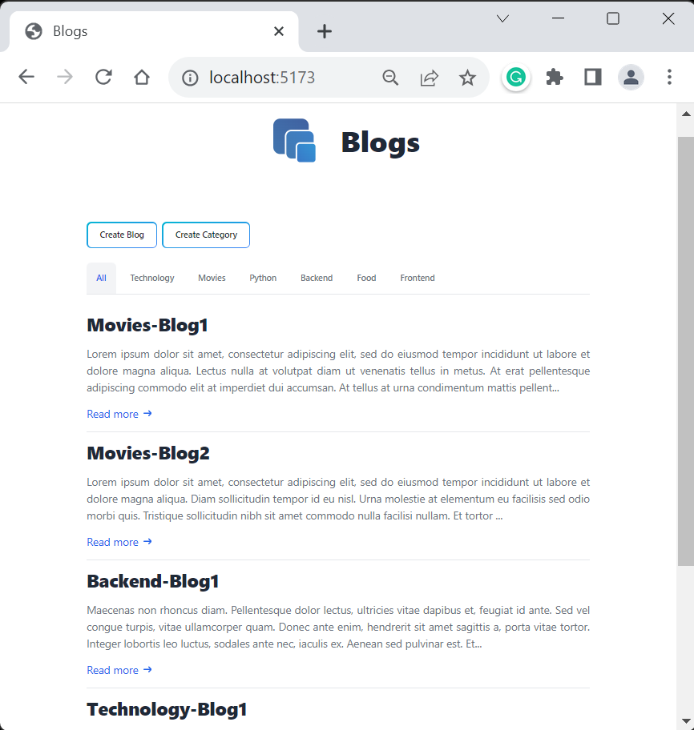
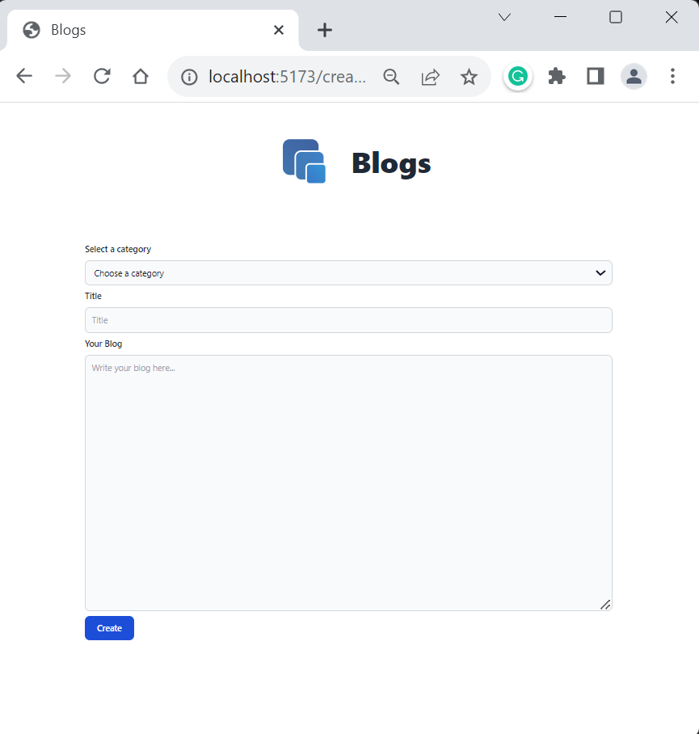
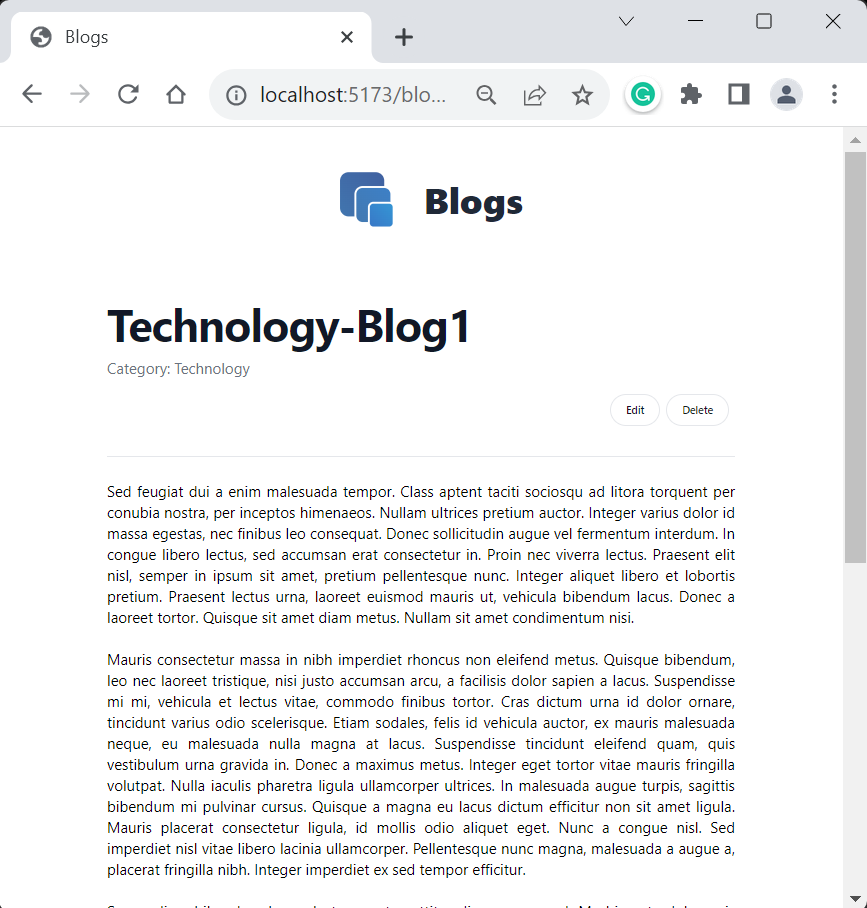

# Blogs

Simple react app to CREATE/READ/UPDATE/DELETE blogs.

## Initialize
### Backend
`$ cd backend && npm run dev`

### Frontend
`$ cd frontend && npm run dev`

## Samples

## Tools

### Frontend
* React
* React-router-dom
* Tailwind CSS

### Backend
* Express
* Firebase

### Database

* Firebase/Firestore

